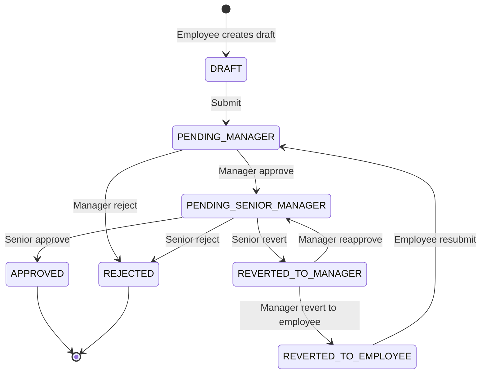

# ExpenseFlow

ExpenseFlow is a production-style take-home implementation of a two-step expense reimbursement workflow. It uses a monorepo with a Next.js frontend, Express API, shared validation package, Prisma ORM, PostgreSQL, JWT authentication, audit history, and workflow authorization.

## Architecture

- `apps/web`: Next.js App Router, TypeScript, Tailwind CSS, React Hook Form, Zod, TanStack Query, Axios.
- `apps/api`: Express, TypeScript, Prisma, PostgreSQL, JWT auth, bcrypt, multer uploads, rate limiting, Helmet, centralized errors.
- `packages/shared`: shared enums, labels, TypeScript DTOs, and Zod schemas used by both apps.
- PostgreSQL stores normalized roles, users, claims, approval history, and hashed refresh-token sessions.

## Features

- Four roles: Employee, Manager, Senior Manager, and Admin.
- JWT access tokens with HTTP-only refresh-token cookies, rotation, logout, and session revocation.
- Resource-level workflow authorization through `pendingWithUserId`, not frontend-only button hiding.
- Draft creation, editing, deletion, submission, two-step review, senior revert, manager reapprove, manager revert-to-employee, and employee resubmission.
- Chronological audit timeline for every important workflow action.
- Paginated, searchable, filterable claim lists with status, category, date range, and restricted sorting.
- Admin user creation/editing, activation/deactivation, reporting-line assignment, all-claims view, and monthly reports.
- Local receipt uploads for JPEG, PNG, WEBP, and PDF files.
- Server-Sent Events notify employees when claim status changes.

## Workflow



All workflow actions run in a transaction, verify role plus `pendingWithUserId`, update by claim `id` and `version`, and append an audit record. A stale version returns `409 CONFLICT`.

## Local Setup

```bash
docker compose up -d
npm install
npm run db:migrate
npm run db:seed
npm run dev
```

Frontend: `http://localhost:3000`  
API: `http://localhost:4000`  
Health check: `GET http://localhost:4000/health`

Or use the all-in-one local starter:

```bash
npm run start:all
```

To reset and load demo data while starting:

```bash
npm run start:all -- --seed
```

## Environment

Copy `.env.example` to `.env` for the API and web environment values. In local development, `COOKIE_SECURE=false` allows the HTTP-only refresh cookie over plain HTTP. CORS is restricted to `WEB_APP_URL`, and API calls use `withCredentials` so refresh-token rotation works from the browser.

## Demo Credentials

All seeded users use development-only password `Password123!`.

- Admin: `admin@expenseflow.test`
- Senior Manager: `senior@expenseflow.test`
- Manager: `manager1@expenseflow.test`
- Manager: `manager2@expenseflow.test`
- Employee: `employee1@expenseflow.test`

## API Overview

Routes are versioned under `/api/v1`.

- Auth: `/auth/signup`, `/auth/login`, `/auth/refresh`, `/auth/logout`, `/auth/me`
- Employee claims: create, list mine, get, update, delete draft, submit, resubmit, history
- Manager: `/manager/claims`, approve, reject, reapprove, revert-to-employee, history
- Senior Manager: `/senior-manager/claims`, approve, reject, revert, history
- Admin: list/create/get/update users, status changes, reporting lines, all claims, monthly summary
- Uploads: `/uploads/receipts`
- SSE: `/events`

Responses use:

```json
{ "success": true, "data": {} }
```

and:

```json
{ "success": false, "error": { "code": "CODE", "message": "Message" } }
```

## Database Model

- `roles`: normalized role names.
- `users`: self-referencing reporting line through `managerId` and `seniorManagerId`.
- `claims`: decimal amount, snapshotted assigned manager/senior manager, current workflow state, current pending user, optimistic `version`.
- `approval_history`: append-only application audit trail.
- `refresh_sessions`: hashed refresh token, expiry, revocation, replacement link.

Indexes support login, reporting-line lookup, inbox queries, employee claim history, expense-date filters, audit timeline fetches, and session cleanup:

- `users.email`, `users.managerId`, `users.seniorManagerId`
- `claims.employeeId`, `claims.pendingWithUserId`, `claims.status`
- `claims(pendingWithUserId, status, createdAt)`
- `claims(employeeId, createdAt)`
- `claims.expenseDate`
- `approval_history.claimId`, `approval_history(actorId, createdAt)`
- `refresh_sessions.userId`, `refresh_sessions.expiresAt`

## Security Decisions

- Passwords are hashed with bcrypt.
- Access tokens are short-lived JWTs.
- Refresh tokens are JWTs stored in HTTP-only cookies; only hashes are stored in the database.
- Refresh rotation revokes old sessions.
- Deactivated users cannot login or refresh.
- Signup and login are rate-limited.
- Backend authorization never trusts frontend role or ownership fields.
- Upload filenames are random; JPEG, PNG, WEBP, and PDF are allowed up to `MAX_UPLOAD_SIZE`.
- Helmet, CORS allowlist, body limits, Zod validation, and centralized error handling are enabled.

## Tests

```bash
npm run test
npm run lint
npm run typecheck
npm run build
```

The backend Supertest suite covers employee ownership, pending-claim edit blocking, reviewer assignment authorization, manager approval, senior-manager step protection, senior revert routing, manager revert constraints, mandatory rejection notes, refresh-token rotation, and optimistic concurrency.

## Deployment

- Frontend: deploy `apps/web` to Vercel with `NEXT_PUBLIC_API_BASE_URL` set to the production API URL plus `/api/v1`.
- Backend: deploy `apps/api` to Railway or Render.
- Database: use Neon, Railway PostgreSQL, or another managed PostgreSQL service.
- Run migrations in production with:

```bash
npm --workspace apps/api run db:deploy
```

If a deployment platform does not run Prisma generation during install, run:

```bash
npm run db:generate
```

Set `COOKIE_SECURE=true`, strong JWT secrets, production `WEB_APP_URL`, and a persistent `UPLOAD_DIR` or S3-compatible storage.

## Tradeoffs

- Local file storage is used for take-home simplicity; production should use S3-compatible object storage.
- Reporting hierarchy is snapshotted onto the claim at submission to keep in-flight approvals stable.
- Refresh tokens are stored only as hashes.
- User deactivation is blocked while the user owns pending workflow tasks.
- Monthly reports group claims by submission month.
- The audit table is application-level append-only; database triggers could enforce stronger immutability in production.
- A monorepo is used to share types and validation schemas.

## Known Limitations

- The admin reporting-line form accepts user IDs directly; a production UX would use searchable pickers.
- SSE authenticates using a short-lived access token query parameter because native `EventSource` cannot set authorization headers.
- Uploads are local-only in this implementation.

## Live Walkthrough Talking Points

- Central workflow service enforces role, assignment, state, and version in one transaction.
- `pendingWithUserId` provides resource-level authorization beyond role checks.
- Snapshotted approvers preserve workflow stability after reporting-line changes.
- Refresh-token rotation stores only token hashes and revokes old sessions.
- Shared Zod schemas reduce frontend/backend drift.

## Interviewer-Friendly Small Changes

- Add a finance-only role that can view approved claims.
- Add a CSV export to the monthly report.
- Add a receipt upload widget to the claim form.
- Add status badges with stricter color semantics.
- Add an admin reassignment flow for pending claims before deactivating a reviewer.
